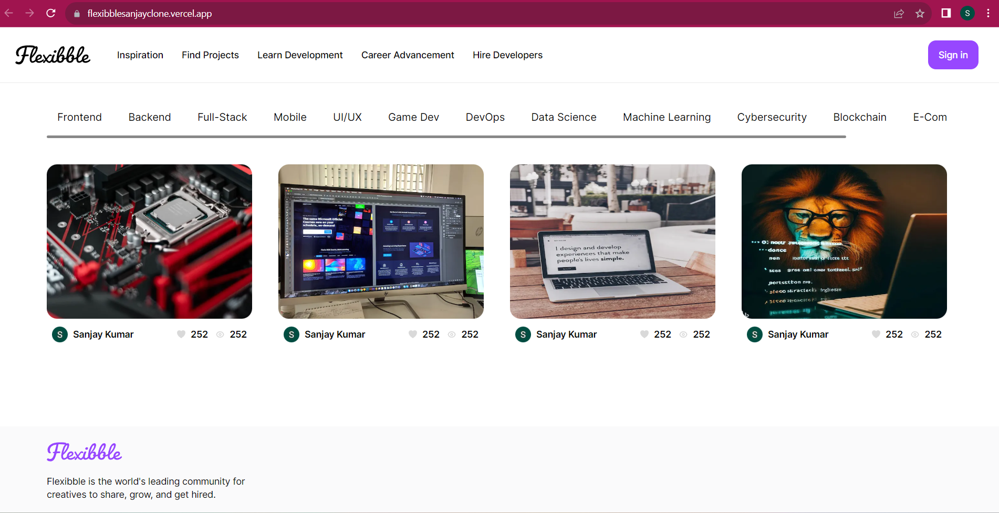
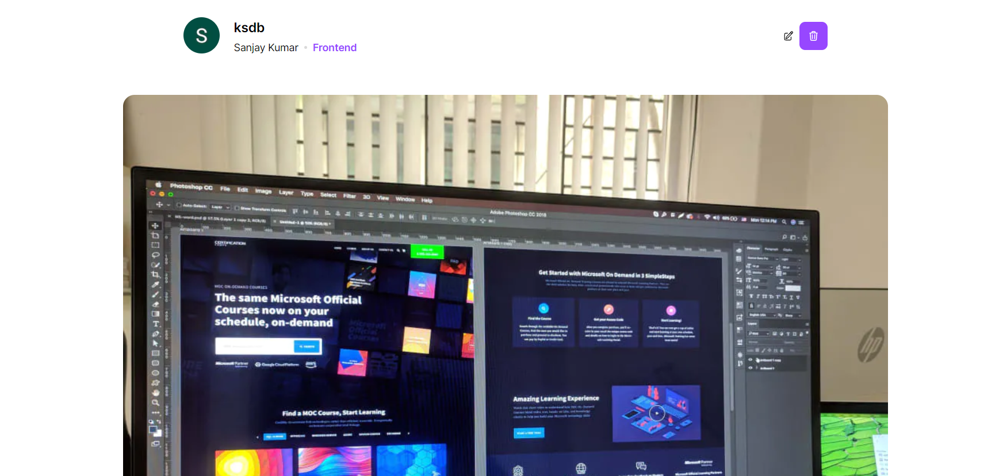
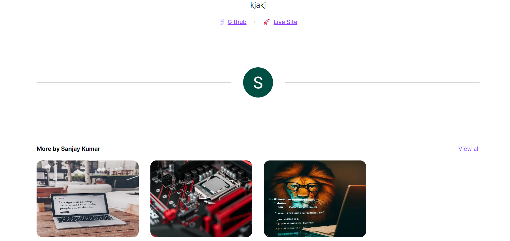
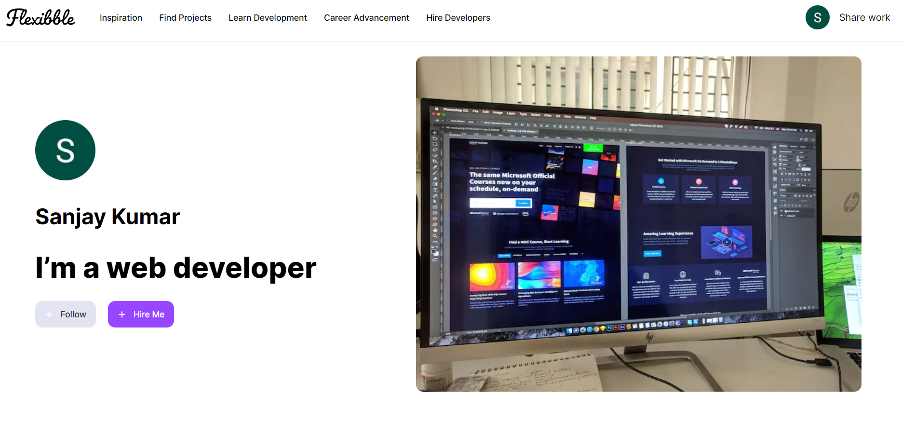

<a name="readme-top"></a>

<div align="center">

  
  <p>
  Flexibble is a community for creatives to share, grow, and get hired.
  </p>
   
 <h4>
    <a href="https://flexibblesanjayclone.vercel.app/">View Demo</a>
  <span> · </span>
    <a href="https://github.com/Sanjay0712/fribble/blob/main/README.md">Documentation</a>
  <span> · </span>
    <a href="https://github.com/Sanjay0712/flexibbleMain/issues/">Report Bug</a>
  <span> · </span>
    <a href="https://github.com/Sanjay0712/flexibbleMain/issues/">Request Feature</a>
  </h4>
</div>

<br />

<!-- Table of Contents -->
<details>

<summary>

# :notebook_with_decorative_cover: Table of Contents

</summary>

- [About the Project](#star2-about-the-project)
  - [Folder Structure](#bangbang-folder-structure)
  - [Tech Stack](#space_invader-tech-stack)
  - [Environment Variables](#key-environment-variables)
- [Getting Started](#toolbox-getting-started)
- [Screenshots](#camera-screenshots)
- [Contributing](#wave-contributing)
- [License](#warning-license)
- [Contact](#handshake-contact)
- [Acknowledgements](#gem-acknowledgements)

</details>


<!-- About the Project -->

## :star2: About the Project

<div align="center"> 
  
</div>
<br />
Next.js has the potential to revolutionize the industry and forever change the way we develop web applications. You’re still early in catching the trend and building your own Next.js 13 applications with TypeScript that leverage features such as server-side rendering and the app router.

This repository houses an amazing Full Stack Next.js 13 Application. the application uses:
- Use Next.js 13 App Router and Server side Rendering
- Implement Filtering Functionality
- Complete Pagination Capabilities
- Handle image uploads
- TypeScript
- Grafbase - a serverless GraphQL platform

<!-- Folder Structure -->

### :bangbang: Folder Structure

Here is the code folder structure.
```
Flexibble-Web/
├── app/
│   ├── api/
│   │   ├── auth/
|   |   |   |── [...nextauth]
|   |   |   |   └── route.ts
|   |   |   └── token
|   |   |       └── route.ts
│   │   └── upload/
|   |       └── route.ts
│   ├── create-project/
|   |   └── page.tsx
│   ├── edit-project/
│   │   └── [id]/
|   |       └── page.tsx
│   ├── profile/
│   │   └── [id]/
|   |       └── page.tsx
│   ├── project/
│   │   └── [id]/
|   |       └── page.tsx
│   ├── favicon.ico
│   ├── globals.css
│   ├── layout.tsx
│   └── page.tsx
├── components/
│   ├── client/
│   │   ├── AuthProviders.tsx
│   │   ├── Categories.tsx
│   │   ├── Modal.tsx
│   │   ├── Pagination.tsx
│   │   ├── ProfileMenu.tsx
│   │   ├── ProjectActions.tsx
│   │   ├── ProjectCard.tsx
│   │   ├── ProjectForm.tsx
│   │   └── index.ts
│   ├── server/
│   │   ├── Button.tsx
│   │   ├── CustomMenu.tsx
│   │   ├── Footer.tsx
│   │   ├── Navbar.tsx
│   │   ├── FormField.tsx
│   │   ├── ProfilePage.tsx
│   │   └── RelatedProjects.tsx
|   └── ...
├── constants/
|   └── index.ts
├── grafbase/
│   ├── .env
│   └── grafbase.config.ts
├── graphql/
│   └── index.ts
├── lib/
│   ├── actions.ts
│   └── session.ts
├── public/
│   └── ...
├── .env
├── common.types.ts
├── next.config.js
├── package.json
├── postcss.config.js
├── tsconfig.json
└── tailwind.config.js
```

<!-- TechStack -->

### :space_invader: Tech Stack

[](https://skillicons.dev)

<p align="right">(<a href="#readme-top">back to top</a>)</p>

<!-- Environment Variables -->

### :key: Environment Variables

_Flexibble Web_ web application uses [Grafbase](https://grafbase.com/), [Cloudinary](https://cloudinary.com/) and [Google Cloud](https://cloud.google.com/) to handle authentication, storage and database. Therefore, you need to create accounts on [Grafbase](https://grafbase.com/), [Cloudinary](https://cloudinary.com/) and [Google Cloud](https://cloud.google.com/) and get your API keys and add them to the environment variables in the `.env` file.

To run this project, you will need to add the following environment variables to your .env file

```env
NEXT_PUBLIC_GRAFBASE_API_URL=<GRAFBASE_API_URL>
NEXT_PUBLIC_GRAFBASE_API_KEY=<GRAFBASE_API_KEY>
GOOGLE_CLIENT_ID=<GOOGLE_CLIENT_ID>
GOOGLE_CLIENT_SECRET=<GOOGLE_CLIENT_SECRET>
NEXTAUTH_SECRET=<NEXTAUTH_SECRET>
NEXTAUTH_URL=<NEXTAUTH_URL>
CLOUDINARY_CLOUD_NAME=<CLOUDINARY_CLOUD_NAME>
CLOUDINARY_API_KEY=<CLOUDINARY_API_KEY>
CLOUDINARY_API_SECRET=<CLOUDINARY_API_SECRET>
```

Also, you need to add the following environment variables to your .env file at `grafbase/` folder

```env
NEXTAUTH_SECRET=<NEXTAUTH_SECRET>
```

<p align="right">(<a href="#readme-top">back to top</a>)</p>

<!-- Getting Started -->

## :toolbox: Getting Started

This is a [Next.js](https://nextjs.org/) project bootstrapped with [`create-next-app`](https://github.com/vercel/next.js/tree/canary/packages/create-next-app).

### Getting Started

First, run the development server:

```bash
npm run dev
# or
yarn dev
# or
pnpm dev
```

Open [http://localhost:3000](http://localhost:3000) with your browser to see the result.

You can start editing the page by modifying `app/page.tsx`. The page auto-updates as you edit the file.

This project uses [`next/font`](https://nextjs.org/docs/basic-features/font-optimization) to automatically optimize and load Inter, a custom Google Font.

### Learn More

To learn more about Next.js, take a look at the following resources:

- [Next.js Documentation](https://nextjs.org/docs) - learn about Next.js features and API.
- [Learn Next.js](https://nextjs.org/learn) - an interactive Next.js tutorial.

You can check out [the Next.js GitHub repository](https://github.com/vercel/next.js/) - your feedback and contributions are welcome!

### Deploy on Vercel

The easiest way to deploy your Next.js app is to use the [Vercel Platform](https://vercel.com/new?utm_medium=default-template&filter=next.js&utm_source=create-next-app&utm_campaign=create-next-app-readme) from the creators of Next.js.

Check out our [Next.js deployment documentation](https://nextjs.org/docs/deployment) for more details.

<p align="right">(<a href="#readme-top">back to top</a>)</p>

<!-- Screenshots -->

## :camera: Screenshots

<div align="center"> 
  
  
  
  
</div>

<p align="right">(<a href="#readme-top">back to top</a>)</p>

<!-- Contributing -->


## :handshake: Contact

Sanjay - [@Github](https://github.com/Sanjay0712) - [@Portfolio](https://sanjay0712.github.io/myPortfolio/)

Email: sanjaydevan07@gmail.com

<p align="right">(<a href="#readme-top">back to top</a>)</p>

<!-- Acknowledgments -->

## :gem: Acknowledgements

These are the tech stacks that I have learnt and implemented through this project.

- [NextJS](https://nextjs.org/)
- [React](https://reactjs.org/)
- [React-DOM](https://www.npmjs.com/package/react-dom)
- [TypeScript](https://www.typescriptlang.org/)
- [TailwindCSS](https://tailwindcss.com/)
- [@headlessui/react](https://headlessui.dev/)
- [Cloudinary](https://cloudinary.com/)
- [GraphQL](https://graphql.org/)
- [GraphQL Request](https://www.npmjs.com/package/graphql-request)
- [JWT](https://jwt.io/)
- [NextAuth](https://next-auth.js.org/)
- [Grafbase](https://grafbase.com/)
- [@grafbase/sdk](https://www.npmjs.com/package/@grafbase/sdk)

<p align="right">(<a href="#readme-top">back to top</a>)</p>
